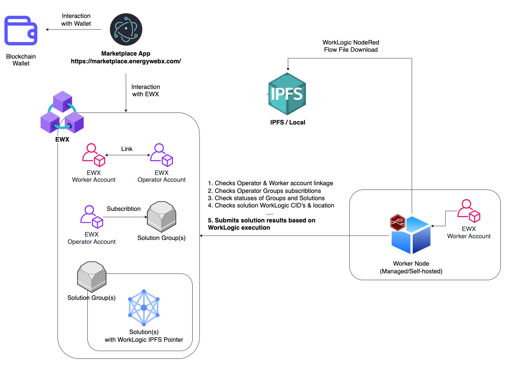

# EWX Worker Node

*Bu belge, [README.md](README.md) dosyasının Türkçe çevirisidir. Güncel/otoriter kaynak İngilizce sürümdür; farklılık olması durumunda İngilizce sürüm esas alınmalıdır.*

## Genel Bakış

### Worker Node Nedir?

Worker Node, iş mantığını bir NodeRed flow dosyası biçiminde çalıştırabilen hafif, zincir-dışı (offchain) bir işlem birimidir.

Worker Node'un çalıştırdığı mantık, geniş bir kullanım senaryosu yelpazesine anlamlı şekilde katkı sağlayabilir.
Örnekler için: [Worker Node Kullanım Senaryoları](https://docs.energyweb.org/ewx-ecosystem/worker-nodes/sample-enterprise-use-cases).

Worker Node işlevleri ve **EWX** blok zinciri bağlantısı, sisteminiz için şeffaflık ve doğrulanabilirlik sağlar.
Ayrıca hafif mimarisi sayesinde Worker Node'lar, merkeziyetsiz çalıştırma bileşenleri gerektiren uygulamalar için oldukça uygundur.

---

### Nasıl Kullanılır?

Worker Node, ilk kurulumu dışında tamamen **blok zinciri tabanlı aksiyonlar** ile kontrol edilir.
Yani ilk Worker kurulumunuz tamamlandıktan sonra herhangi bir ek değişiklik yapmanız gerekmez.

Worker Node davranışını kontrol eden blok zinciri tabanlı aksiyonlar, EW tarafından geliştirilen Blockchain Operator arayüzü olan Marketplace App üzerinden ya da doğrudan blok zinciriyle etkileşime girerek uygulanabilir.

Tam dokümantasyon için: [Worker Node Server Resmi Dokümantasyonu](https://docs.energyweb.org/ewx-ecosystem/worker-nodes/server-based-worker-nodes).

---

## EWX Ekosistemi İçinde Üst Düzey Mimari

Worker Node'un daha geniş EWX ekosistemine nasıl uyduğunu anlamak için aşağıdaki üst düzey mimariye bakabilirsiniz. 

---

## Başlarken

Worker Node'u tam yönetilen (SaaS) veya kendi bulutunuzda (Bring Your Own Cloud / BYOC) modunda çalıştırmak isterseniz lütfen [Launchpad](https://launchpad.energyweb.org) Worker Node teklifimize göz atın.
Yönetilen Worker Node teklifi dokümantasyonu: [Worker Node Managed Offer](https://docs.energyweb.org/launchpad/ewx-ecosystem-offerings/worker-node)

**Kendi kurulumunuzu (self-deployment) yapmak isterseniz aşağıdaki adımları izleyin.**

---

### 0. Worker & Operator Hesaplarını Hazırlayın

Blok zinciri tabanlı işlemler ile Worker Node sunucusu kurulumu birbirinden bağımsız olduğu için, blok zinciri hazırlığına şimdi ya da Worker Node kurulumunu bitirdikten sonra devam edebilirsiniz.

Blok zinciri kurulumuna şimdi devam etmek isterseniz [Blockchain Hesap Kurulum Dokümantasyonu](https://docs.energyweb.org/ewx-ecosystem/worker-nodes/server-based-worker-nodes/bootstrapping-server-based-worker-node-accounts)'na gidip talimatları izleyin.

---

### 1. IPFS'i Hazırlayın

Worker Node, çözüm (solution) WorkLogic NodeRed flow dosyalarını [IPFS (Inter Planetary File System)](https://ipfs.tech) üzerinden alır.
Bu nedenle çalıştırmayı planladığınız çözümler IPFS'te saklanıyorsa, uygun kimlik bilgilerini yapılandırmanız gerekir.

Varsayılan olarak `https://workers-registry.energyweb.org` adresine yapılandırılmıştır, bu yüzden ek bir yapılandırma gerekmez; ancak bu adreste sorun yaşarsanız farklı bir [IPFS Gateway](https://ipfs.github.io/public-gateway-checker/)'e geçebilirsiniz.

Bunu çalıştırmak için `IPFS_URL` ortam değişkenini kullanacağınız gateway ile değiştirmeniz gerekir.

#### 1.1 Infura IPFS

Infura IPFS ile kullanmak da mümkündür; bunun için `IPFS_API_KEY` ve `IPFS_SECRET_KEY` değerlerini sağlayın. `IPFS_URL`'i `https://ipfs.infura.io:5001` olarak değiştirin ve `IPFS_CONTEXT_PATH`'i `/api/v0/cat?arg=` olarak ayarlayın.

**Yalnızca WorkLogic'i yerelde saklanan Çözümleri (Solutions) çalıştırmayı planlıyorsanız, IPFS için herhangi bir örnek (dummy) değer yapılandırabilirsiniz.**

---

### 2. Docker İmajını İndirin

Docker imajı şu bağlantıda mevcuttur: [ewx-worker-node-server](https://github.com/energywebfoundation/ewx-worker-node-server/pkgs/container/ewx-worker-node-server%2Fewx-worker-node-server).

İmajı çekmek için aşağıdaki komutu çalıştırın:

```bash
docker pull ghcr.io/energywebfoundation/ewx-worker-node-server/ewx-worker-node-server:latest
```

---

### 3. Ortam Değişkenlerini Ayarlayın

Ortam değişkenleri hakkında daha fazla bilgiyi [burada](docs/env-vars.md) bulabilirsiniz.

1. Varsayılan ortam dosyasını kopyalamak için aşağıdaki komutu çalıştırın:

   ```bash
   cp .env.default .env
   ```

2. `VOTING_WORKER_SEED` anahtarı altındaki `<SEED>` değerini kendi Worker Hesap Seed'inizle değiştirin. Worker Hesabınızın Operator Hesabınızdan farklı olması gerektiğini unutmayın. Henüz yapmadıysanız, Worker Node hesabı oluşturmak için resmi [Polkadot Dokümantasyonu](https://wiki.polkadot.network/learn/learn-account-generation/)'nda belirtilen cüzdanlardan herhangi birini kullanabilirsiniz.
3. İsteğe bağlı olarak, kullanım amacınıza göre `PRETTY_PRINT` değerini `true` veya `false` olarak değiştirebilirsiniz.

---

### 4. Docker İmajını Çalıştırın

Worker Node'u Kubernetes, Docker Compose veya doğrudan (native) çalıştırabilirsiniz.

#### **Docker ile:**

```bash
docker run --env-file .env --rm ghcr.io/energywebfoundation/ewx-worker-node-server/ewx-worker-node-server:latest
```

#### **Docker Compose ile:**

```bash
docker compose up
```

#### **Helm + Kubernetes ile:**

```bash
helm install ewx-workers-node-service -f helm-chart/values.yaml oci://ghcr.io/energywebfoundation/generic-microservice-helm  -n ewx
```

---

### 5. Worker Node Durumunuzu Doğrulayın

`GET http://localhost:3002/status` isteğini çağırın.

| Durum                       | Açıklama                                          |
| --------------------------- | -------------------------------------------------- |
| STARTED                     | Uygulama önyükleme (bootstrap) sürecine başladı.    |
| EXPOSED_HTTP                | HTTP sunucusu dışarıya açıldı.                      |
| INITIALIZED_WORKER_ACCOUNT  | Worker hesabı başlatıldı.                           |
| PERFORMED_CHECKS            | Gerekli kontroller gerçekleştirildi.                |
| STARTED_RED_SERVER          | NodeRed sunucusu başlatıldı.                        |
| READY                       | Uygulama tamamen hazır.                             |

---

### 6. Worker & Operator Hesaplarını Hazırlayın

Worker kurulumunuz tamamlandı! Bu andan itibaren gerekli işlemlerin çoğu, Operator Hesabınız kullanılarak EWX üzerinde gerçekleştirilecektir.
Eğer blok zinciri kurulumunu daha önce (0. adımın bir parçası olarak) yapmadıysanız, Worker'ınızın istenen mantığı çalıştırmaya başlaması için şimdi blok zinciri tabanlı kurulumu hazırlayabilirsiniz.

Lütfen [Operator Hesap Kurulum Dokümantasyonu](https://docs.energyweb.org/ewx-ecosystem/worker-nodes/server-based-worker-nodes/bootstrapping-server-based-worker-node-accounts)'na gidip kurulum talimatlarını izleyin.

---

### 7. Worker'ınızın Düzgün Çalıştığını Doğrulayın

1. Worker Hesabınıza bağlı Operator Hesabınızla herhangi bir **Solution Group**'a abone olduğunuzda, Worker'ınızdan gelen oyların EWX tarafından kabul edilmesi en fazla 24 saat sürebilir.
2. Bu sürenin ardından Worker'ınız, Operator Hesabınızın abone olduğu, süresi dolmamış Solution Group'lardaki **Active** durumundaki Çözümlerin (Solutions) WorkLogic'ini çalıştırmaya başlayacaktır.
3. Worker'ınızdan gönderilen oyları şu yerlerde görebilmeniz gerekir:
   - Worker Node loglarında
   - Abone olduğunuz Solution Group'ların ayrıntılarını kontrol ederek [Marketplace App Arayüzü](https://marketplace.energywebx.com/)'nde
   - [EWX chainstate](https://polkadot.js.org/apps/?rpc=wss%3A%2F%2Fpublic-rpc.mainnet.energywebx.com%2Fws#/chainstate)'i [bu görselde](images/chainstate-query.png) gösterildiği gibi sorgulayarak (burada Operator adresini kullanın)
   - [EWX indexer](https://ewx-indexer.mainnet.energywebx.com/graphql)'ı [bu ekran görüntüsünde](images/indexer-query.png) gösterildiği gibi sorgulayarak (burada Worker adresini kullanın)

Worker'ınızın çalıştırdığı çözüm WorkLogic'ine bağlı olarak oyların sıklığı, miktarı ve EWX ile etkileşim biçimi önemli ölçüde değişebilir.

Worker'ınızın hata verip vermediğini kontrol etmenin en iyi yolu, logları hatalar ve Worker Node durumu açısından izlemektir.

---

## Docker İmajını Derleyin

Docker imajını yerelde derlemek için aşağıdaki komutu çalıştırın:

```bash
docker build --tag ewx-worker-node-server:latest .
```

---

## Yerelde Derleyin ve Çalıştırın

1. Projeyi derlemek için aşağıdaki komutu çalıştırın:

   ```bash
   npm run build
   ```

2. Projeyi Node.js ile çalıştırın:

   ```bash
   node dist/main.js
   ```

---

## Güvenlik ve Ölçeklenebilirlik Hususları

1. Worker Node'a herkese açık bir uç nokta (public endpoint) atanmasını hiçbir şey engellemese de, önerilen ve tavsiye edilen kullanım her zaman Worker Node'un özel bir ağda güvenli şekilde konumlandırılmasını ve zamanlanmış (scheduled) ya da pull tabanlı tetikleyicilere sahip NodeRed flow'ları kullanılmasını varsayar.

2. Her worker node'un benzersiz bir Worker Hesap seed'i olmalı ve her zaman tekli replika (single replica) modunda çalışmalıdır. Çoklu replika kurulumu belirli uygulamalarla kullanıldığında sorunlara yol açabilir. Ölçeklenebilirlik yoluyla güvenilirliği sağlamak için her Worker Node örneği (instance) için her zaman benzersiz Worker Hesap seed'leri yapılandırın.

3. Worker seed'ini her zaman gizli (secret) bir değer olarak ele alın.

---

## Sıkça Sorulan Sorular (SSS)

### **S: Bir operator hesabı oluşturmanın alternatif bir yolu var mı?**

C: Evet, bir operator hesabını manuel olarak oluşturmak için şu adımları izleyin:

1. [PolkadotJS](https://polkadot.js.org/apps/)'i ziyaret edin.
2. Kullanım amacınıza göre **MAINNET EWX**'i seçin.
3. [PolkadotJS Extrinsics](https://polkadot.js.org/apps/#/extrinsics)'e gidin.
4. Operator olarak `workerNodePallet.signupWorkerNodeOperator` extrinsic'ini çağırın.
5. Operator olarak `workerNodePallet.registerWorker` extrinsic'ini, worker'ınızın adresini geçirerek çağırın.
6. Son olarak operator olarak `workerNodePallet.subscribeOperatorToSolutionGroup` extrinsic'ini çağırın. Grubu elde etmek için `Developer` -> `Chain state` -> `workerNodePallet` -> `solutionsGroups` yolunu izleyin.

### **S: Tek bir Operator Hesabına kaç Worker Hesabı atanabilir?**

C: Şu an için yalnızca tek bir Operator - Worker hesap eşleştirmesi desteklenmektedir. Önceden bağlı bir Worker Hesabının bağlantısını her zaman kesip yerine farklı birini bağlayabilirsiniz.

### **S: Yönetilen (Managed) / Kendi barındırdığım (Self-hosted) Worker Node sürümleri arasında geçiş yapabilir miyim?**

C: Evet, istediğiniz an geçiş yapıp yeni bir Worker'a taşınabilirsiniz. Blok zinciri kurulumuyla uğraşmak istemiyorsanız yeni Worker'ınızda aynı Worker Hesap Seed'ini kullanmanız yeterlidir. Yeni Worker Node kurulduktan hemen sonra eski Worker Node örneğinin durdurulması gerektiğini unutmayın.

## **SSS'nin tam sürümü için lütfen [Resmi Dokümanlarımıza](https://docs.energyweb.org/ewx-ecosystem/worker-nodes/server-based-worker-nodes/faq-server-based-worker-nodes) bakın**

<p align="right">(<a href="#readme-top">başa dön</a>)</p>

---

## Güvenlik Denetimleri (Security Audits)

- [01.12.2023 Denetim Raporu - cure53](https://github.com/energywebfoundation/ew-marketplace/) _(Henüz mevcut değil)_

<p align="right">(<a href="#readme-top">başa dön</a>)</p>

---

## Sürdürücüler (Maintainers)

- [Christopher Szostak](https://github.com/hejkerooo)
- [Vicken Liu](https://github.com/vickenliu)
- [Kamil Witkowski](https://github.com/KaamilW)

---

## Katkıda Bulunma

Açık kaynak topluluğunu öğrenmek, ilham almak ve üretmek için bu kadar harika bir yer yapan şey, tam olarak katkılardır. Yapacağınız her katkı **büyük ölçüde takdir edilir**.

Bu projeyi daha iyi hale getirecek bir öneriniz varsa, lütfen repoyu fork'layıp bir pull request oluşturun. Ayrıca "enhancement" etiketiyle bir issue da açabilirsiniz.

Katkıda bulunma adımları:

1. Projeyi fork'layın
2. Kendi özellik dalınızı (feature branch) oluşturun (`git checkout -b feature/AmazingFeature`)
3. [Conventional Commits](https://www.conventionalcommits.org/en/v1.0.0/) formatına uygun şekilde değişikliklerinizi commit'leyin (`git commit -m 'feat: Add some AmazingFeature'`)
4. Dalınızı push'layın (`git push origin feature/AmazingFeature`)
5. Bir Pull Request açın

<p align="right">(<a href="#readme-top">başa dön</a>)</p>

---

## Lisans

Bu proje GNU General Public License v3.0 veya sonraki bir sürüm altında lisanslanmıştır. Ayrıntılar için [LICENSE](/LICENSE) dosyasına bakın.

<p align="right">(<a href="#readme-top">başa dön</a>)</p>

---

## İletişim

- [X](https://x.com/xenergyweb)

- [Discord](https://discord.gg/psraNwqGqp)
- [Telegram](https://t.me/energyweb)

Proje Bağlantısı: [ewx-worker-node-server](https://github.com/energywebfoundation/ewx-worker-node-server)

<p align="right">(<a href="#readme-top">başa dön</a>)</p>
